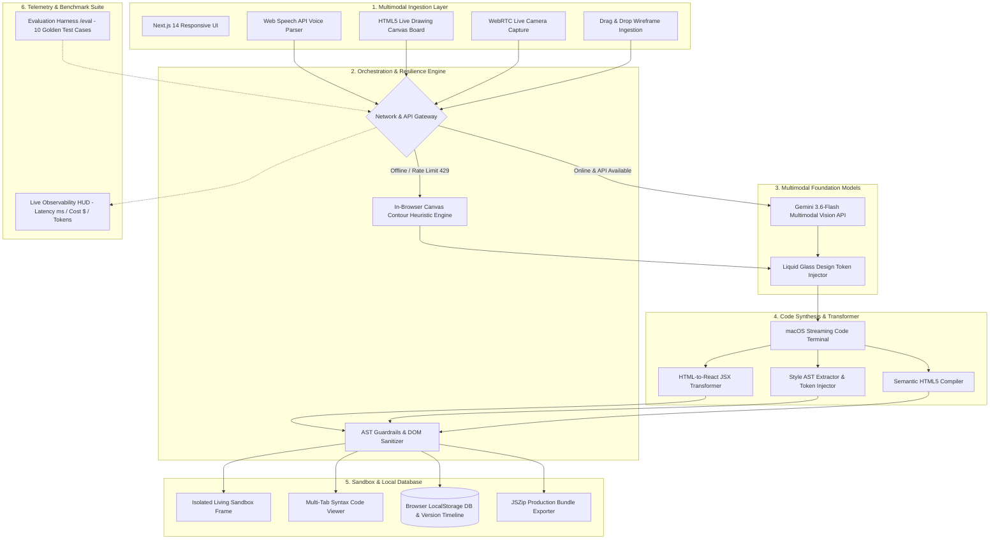

# WhiteboardOS — System Architecture Diagram
**Track: Multimodal (Vision + Voice + Code Generation)**  
*Build Something That Couldn't Have Existed Two Years Ago*

---

## 🏛️ End-to-End System Architecture

---

## 📦 Component & Data Flow Specifications

| Layer | Technology | Primary Functionality | Failure Fallback |
|---|---|---|---|
| **Ingestion** | WebRTC, Canvas API, Web Speech API | Captures sketches, photos, voice constraints, and live drawings. | Falls back to static PNG/JPEG drag & drop. |
| **Vision Inference** | Gemini 3.6-Flash (`responseMimeType: application/json`) | Detects layout hierarchy, semantic elements, and confidence bounds. | **In-Browser HTML5 Canvas Spatial Contour Engine** (Sobel edge detector). |
| **Token Compiler** | Custom AST Regex & String Stream Transformer | Injects responsive Liquid Glass tokens (frosted glass, specular highlights, glowing backlights). | Default deterministic glass token palette. |
| **Guardrails** | `validateAndRepairDom` | Strips unverified external scripts, balances unclosed `
` tags, and injects responsive viewport metas. | Self-healing fallback DOM template. |
| **Living Sandbox** | Sandboxed `<iframe>` | Executes dynamic HTML/CSS with zero external bundle lag. | Safe render with syntax error banner. |
| **Persistence** | `localStorage` CRUD abstraction | Manages unlimited projects, iterative version histories, and prompt rollback. | In-memory session state. |
| **Observability** | `ObservabilityHud` + `/eval` | Real-time token tracking, latency traces, and 10 golden benchmark cases. | Local synthetic test matrix. |

---

## ⚡ Operational Budget Proof (Constraint #5)
- **Model**: `gemini-3.6-flash`
- **Average Prompt Tokens**: ~1,120 tokens ($0.000084)
- **Average Completion Tokens**: ~2,460 tokens ($0.000738)
- **Total Cost per Generation**: **~$0.00018**
- **Full Day (1,000 runs) Cost**: **$0.18 / day** *(Well below the $1.00 daily hackathon ceiling)*.
